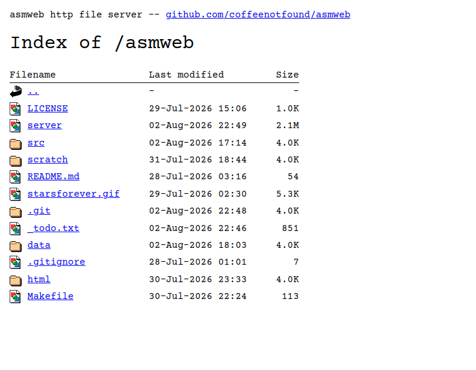

**asmweb** is a static html file server written purely in x86_64 assembly for linux, without any dependencies (not even libc)

> [!NOTE]
> This project was fully written by hand, no clanker involved

### Usage
The server is a simple http file server and as such servers all files in the `data/` directory. The repo includes some test files (including a symlink to the [repo](http://localhost:8080/asmweb) itself!) so you can quickly test out the file listings.

To run the server you can either call `make run` which will automatically compile it or just manually invoke the binary via `./server` after it's compiled. Note that right now it doesn't support passing any cli flags to configure the server (data dir path, port, etc.), but that's something I may add in the future.

After starting the server, the root data directory listing is now available at [`http://localhost:8080`](http://localhost:8080)

### Compiling
Compiling the server binary is done simply via `make build`, being written to `./server`

### Design
#### Routes
Like most static http servers, the server primarily has two routes:
(A) when the url path refers to a directory, a file listing html page is dynamically generated and sent back or (B) when the url path refers to a file, the server echos back all the data of the file.
All http transactions are assumed to be connection-per-request (signaled via the "Connection: close" header on each response).

#### MIME Sniffing
No responses for file routes send any `Content-Type` header which luckily is enough to get browsers to MIME-sniff the
content for at least the cases I care about (e.g. images and text files being displayed inline in the browser instead of automatically downloading). This may or may not work in all browsers, but Firefox and Chrome seem to handle it just fine.
Of course proper mime-type detection on the server side would be better (then I could even have distinct icons per file category), but this project took way too long already, so I haven't done that so far.

#### Html
The html templating is done in an incremental "search and replace" type of way. First the base template [`html/index.html`](html/index.html) is loaded into a buffer which contains "slots" in form of html comment tags (e.g. `<!--SLOT_INDEXFILE_PATH-->`). These slots serve as areas to be replaced by actual content if desired by replacing them with other html template strings. These sub-templates can and do also contain slot placeholders, which can further be replaced by data.
For dynamic lists, a template simply contains it's own template placeholder at the end again ([`<!--SLOT_INDEXFILE_NEXT-->`](html/slot_indexfile.html:6)) again, allowing my to chain as many of the elements together as I want.
And since the placeholders are just html comments.

The current implementation isn't the most efficient as it uses a set of ping-pong buffers, searching within and copying the entire string data back and forth on each slot replace. A smarter "piece buffer" version is implemented in a PoC C implementation in [`scratch/pbuf._c`](scratch/pbuf._c), but I haven't implemented that in asm yet (and may not considering even the "slow" search-and-replace is very fast -- thanks x86 chip makers :P)

### License

MIT, do what you want with this, not like it's all that useful :P
